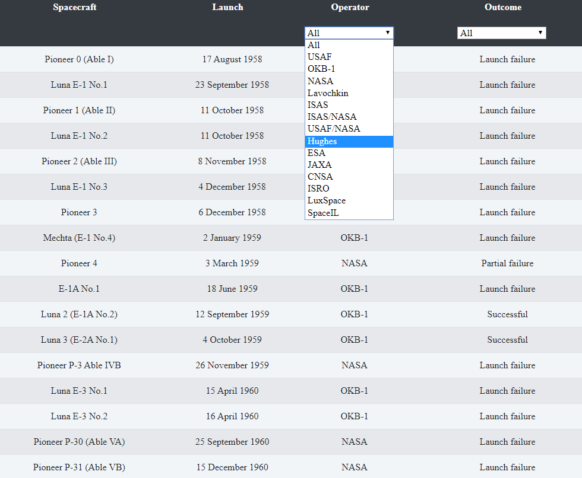

# Lodash-moon-landing

I learned how to use lodash library for collections in moon landings datatable. Datable is taking from wikipedia i cant find good API for it.

## Tools & Technologies I've used
* VSC
* CSS3
* Javascript
  * Lodash Library
  * Import / Export
